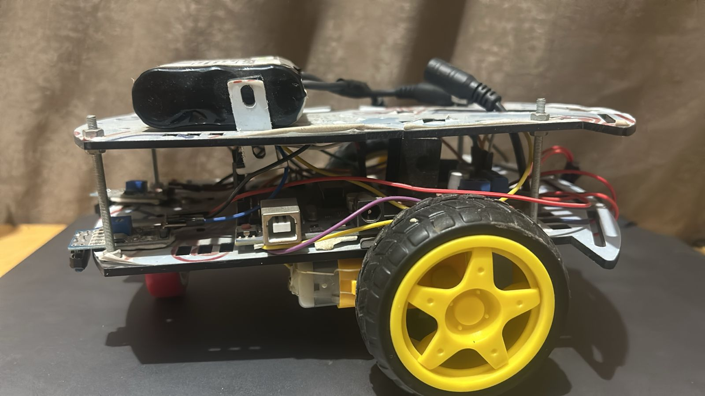
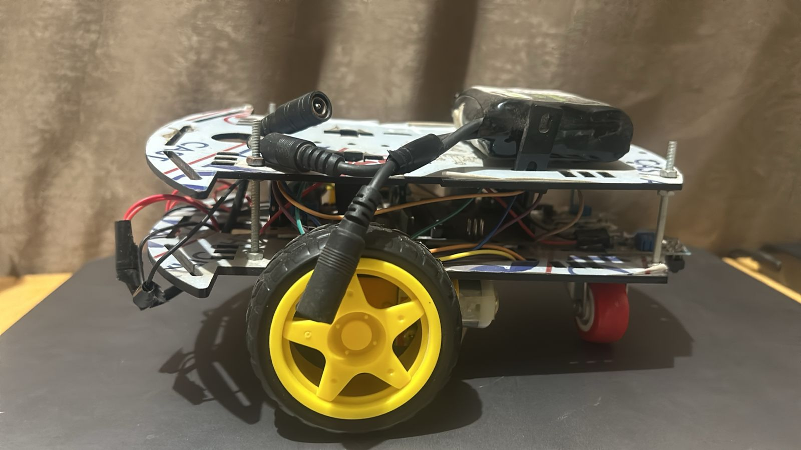

# Line Follower Robot

Line Follower Robot is an autonomous embedded system designed to follow a black line using Arduino Uno, IR sensors, and DC motors. The project includes a Proteus simulation for validation, Arduino firmware for real-time control, and hardware documentation for assembly. It features PWM speed control, turn logic, and recovery mechanisms for robust navigation. This implementation demonstrates embedded systems principles, sensor integration, and motor control in IoT contexts.

## Repository Structure

- **CAR_IMG/**: Hardware documentation images (real robot assembly and components).
- **LineFollower AR/**: Arduino source code for line following algorithm, including build artifacts (hex, elf files).
- **LineFollower Proteus/**: Proteus simulation files (.pdsprj and backups) for circuit validation.
- **Documentation.pdf**: Complete project report (if available; otherwise, refer to README for details).

## Technical Specifications

- **Microcontroller**: Arduino Uno (ATmega328P, 16 MHz clock).
- **Sensors**: Two IR reflective sensors for line detection (left on pin 4, right on pin 3; output 0 for black line, 1 for white surface).
- **Motor Driver**: L298N dual H-bridge for bidirectional control and PWM speed adjustment (pins 5-10).
- **Motors**: Two TT gear DC motors (left: IN1/IN2 on pins 9/8, ENA on pin 10; right: IN3/IN4 on pins 7/6, ENB on pin 5).
- **Power**: 5V for Arduino, 7-12V for motors via L298N.
- **Control Algorithm**: Digital logic-based line following with optional backward recovery after 50 stop cycles.
- **Debug**: Serial monitor at 9600 baud for sensor values.

## Implementation

The system uses two IR sensors to detect the black line on a white surface. The Arduino reads the sensors via digitalRead and applies logic to control the L298N driver, adjusting motor directions and speeds with analogWrite (PWM at 150/255 for forward).

### Logic Flow
- Both sensors on line (0, 0): Move forward (both motors forward at 150 PWM).
- Left on line, right off (0, 1): Turn right (left motor full, right stopped).
- Left off, right on (1, 0): Turn left (right motor full, left stopped).
- Both off line (1, 1): Stop; if prolonged (>50 cycles), move backward briefly and reset.

### Circuit Connections
- IR Left OUT to Arduino pin 4, VCC to 5V, GND to GND.
- IR Right OUT to Arduino pin 3, VCC to 5V, GND to GND.
- L298N: IN1/IN2 to pins 9/8 (left motor), IN3/IN4 to pins 7/6 (right motor), ENA/ENB to pins 10/5 (PWM), VCC to 12V, GND shared.
- Motors: Left to OUT1/OUT2, Right to OUT3/OUT4.

 <!-- Replace with your Proteus screenshot path if different -->

 <!-- Replace with your real robot image path -->

### Code Overview
The firmware is in [LineFollower.ino](LineFollower AR/LineFollower/LineFollower.ino). Key sections:
- Setup: Configure pins as output/input and initialize Serial.
- Functions: forward(), backward(), left(), right(), stopp() for motor control.
- Loop: Read sensors, apply logic, print debug to Serial, 10ms delay for stability.

Example snippet:
```cpp
void loop() {
  sl = digitalRead(sensorL);
  sr = digitalRead(sensorR);
  Serial.print("Left: "); Serial.print(sl); Serial.print(" | Right: "); Serial.println(sr);
  
  if (sl == 0 && sr == 0) { forward(); stopCounter = 0; }
  else if (sl == 0 && sr == 1) { right(); stopCounter = 0; }
  else if (sl == 1 && sr == 0) { left(); stopCounter = 0; }
  else { stopp(); stopCounter++; if (stopCounter > 50) { backward(); delay(200); stopCounter = 0; } }
  
  delay(10);
}
```

## How to Use

1. **Simulation**: Open [New Project.pdsprj](LineFollower Proteus/New Project.pdsprj) in Proteus, run simulation, use Logic Probe on pins 3/4 to simulate line detection.
2. **Firmware Upload**: Open [LineFollower.ino](LineFollower AR/LineFollower/LineFollower.ino) in Arduino IDE, verify, upload to Arduino Uno.
3. **Hardware Assembly**: Follow schematic, power on, place robot on black line, monitor Serial for sensor values.

For troubleshooting, refer to Serial output or Proteus logs. Extend with PID for smoother turns.

## License
MIT License – feel free to use and modify.

For questions or contributions, open an issue.
